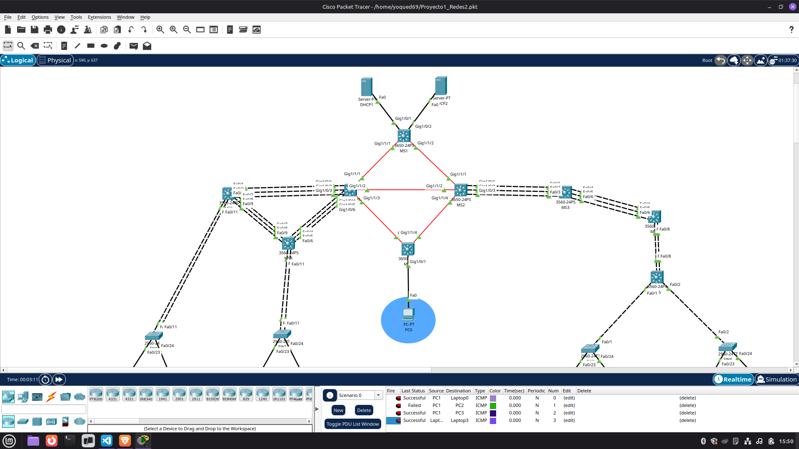
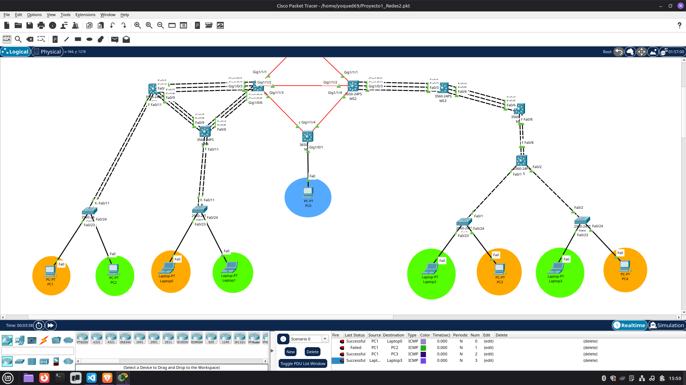
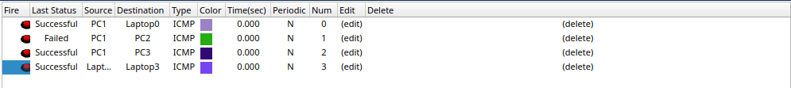

# Proyecto 1 — Chapin Red

## Redes de Computadoras 2

**Universidad de San Carlos de Guatemala**
**Facultad de Ingeniería — Ingeniería en Ciencias y Sistemas**

**Estudiante:**
**Carné:** 202103988

---

# 1. Introducción

El presente proyecto consiste en el diseño e implementación de una **red corporativa multi-edificio** para la organización **Chapin Red**, utilizando **Cisco Packet Tracer**. La solución fue desarrollada aplicando principios de segmentación lógica, arquitectura jerárquica de red, redundancia en enlaces, enrutamiento dinámico, asignación automática de direcciones IP y control de acceso entre redes.

De acuerdo con el enunciado del proyecto, la implementación debía contemplar la interconexión entre edificios, el uso de VLANs, VTP, LACP, PAgP, DHCP, ACL, STP y un protocolo de enrutamiento dinámico. En este caso se utilizó **OSPF** como protocolo de enrutamiento. 

La red fue construida para cumplir los siguientes objetivos:

* Segmentar departamentos mediante VLANs.
* Facilitar la administración de la red.
* Permitir comunicación controlada entre edificios.
* Implementar redundancia en enlaces críticos.
* Asignar direcciones IP dinámicamente con DHCP.
* Restringir el tráfico entre VLANs mediante ACLs.

---

# 2. Objetivo del Proyecto

Diseñar e implementar una red empresarial multi-edificio funcional en Cisco Packet Tracer, aplicando arquitectura jerárquica, segmentación mediante VLANs, enlaces troncales, EtherChannel, enrutamiento dinámico, DHCP Relay y listas de control de acceso, documentando los comandos principales, el direccionamiento IP y las pruebas de conectividad realizadas. Esto coincide con lo solicitado en el enunciado oficial, el cual exige una topología funcional, archivo `.pkt` y un manual técnico en Markdown con topología, subnetting, configuraciones y comandos. 

---

# 3. Arquitectura de la Red

La red fue organizada usando una **arquitectura jerárquica de tres capas**.

| Capa         | Función                                              | Dispositivos           |
| ------------ | ---------------------------------------------------- | ---------------------- |
| Core         | Interconexión principal y transporte entre edificios | **MS9, MS3**           |
| Distribución | Enrutamiento inter-VLAN y enlace con capa de acceso  | **MS8, MS5**           |
| Acceso       | Conexión de dispositivos finales                     | **SW1, SW2, SW3, SW4** |

> **Nota importante:** en esta topología, **MS9 y MS3 son los switches core**, tal como fue definido en la implementación realizada.

---

# 4. Descripción General de la Topología

La topología implementada se divide en tres grandes zonas:

* **Edificio Izquierdo**
* **Edificio Derecho**
* **Backbone o área central**

Según el enunciado, la red debía representar una interconexión multi-edificio con enlaces de fibra entre switches multicapa y con segmentación por VLANs, además de arquitectura jerárquica en el edificio principal. Esa estructura se observa en los diagramas del documento, donde se muestra la red MAN entre edificios y la separación por capas en los edificios izquierdo y derecho. 

---

# 5. Estructura de Switches

## 5.1 Edificio Izquierdo

| Dispositivo | Función                |
| ----------- | ---------------------- |
| **MS9**     | Switch Core            |
| **MS8**     | Switch de Distribución |
| **SW1**     | Switch de Acceso       |
| **SW2**     | Switch de Acceso       |

Tecnologías aplicadas:

* VLAN
* VTP
* Enlaces troncales
* EtherChannel con **LACP**
* Enrutamiento inter-VLAN
* DHCP Relay
* ACL

---

## 5.2 Edificio Derecho

| Dispositivo | Función                                 |
| ----------- | --------------------------------------- |
| **MS3**     | Switch Core                             |
| **MS4**     | Switch de Distribución / enlace troncal |
| **MS5**     | Switch de Distribución                  |
| **SW3**     | Switch de Acceso                        |
| **SW4**     | Switch de Acceso                        |

Tecnologías aplicadas:

* VLAN
* VTP
* Enlaces troncales
* EtherChannel con **PAgP**
* Enrutamiento inter-VLAN
* DHCP Relay
* ACL

---

## 5.3 Backbone / Área Central

| Dispositivo | Función                            |
| ----------- | ---------------------------------- |
| MS1         | Conexión central / servidores DHCP |
| MS2         | Backbone                           |
| MS6         | Backbone                           |
| MS7         | Backbone principal                 |

Conexiones principales documentadas:

```text
MS1 ↔ MS2
MS1 ↔ MS7
MS2 ↔ MS6
MS6 ↔ MS7
MS2 ↔ MS3
MS7 ↔ MS8
MS7 ↔ MS9
```

Esta parte de la red se encarga de mantener la conectividad entre edificios y con los servicios centrales.

---

# 6. VLANs Implementadas

Se implementaron cinco VLANs, siguiendo una numeración lógica y la convención de nombres solicitada en el proyecto. El enunciado recomienda un esquema como 10, 20, 30, 40 y 99, además de nombres con formato `VLAN_[Color]_Edificio[IZQ/DER]_[Carnet]`. 

| VLAN | Nombre                             |
| ---- | ---------------------------------- |
| 10   | VLAN_Naranja_EdificioIZQ_202103988 |
| 20   | VLAN_Verde_EdificioIZQ_202103988   |
| 30   | VLAN_Naranja_EdificioDER_202103988 |
| 40   | VLAN_Verde_EdificioDER_202103988   |
| 99   | VLAN_Admin_202103988               |

---

# 7. Configuración de VLANs

Las VLANs fueron creadas en los switches configurados como **VTP Server**.

```bash
conf t

vlan 10
name VLAN_Naranja_EdificioIZQ_202103988

vlan 20
name VLAN_Verde_EdificioIZQ_202103988

vlan 30
name VLAN_Naranja_EdificioDER_202103988

vlan 40
name VLAN_Verde_EdificioDER_202103988

vlan 99
name VLAN_Admin_202103988

end
wr
```

---

# 8. Configuración de VTP

Para evitar crear manualmente las VLANs en todos los switches, se implementó **VTP versión 2**, con un dominio y contraseña definidos por el estudiante, tal como permite el enunciado. 

## 8.1 Dominio VTP

```text
CHAPINRED988
```

## 8.2 Contraseña VTP

```text
chapinred988
```

## 8.3 Switches VTP Server

* **MS9**
* **MS3**

```bash
conf t
vtp domain CHAPINRED988
vtp password chapinred988
vtp version 2
vtp mode server
end
wr
```

## 8.4 Switches VTP Client

* MS8
* MS4
* MS5
* SW1
* SW2
* SW3
* SW4

```bash
conf t
vtp domain CHAPINRED988
vtp password chapinred988
vtp version 2
vtp mode client
end
wr
```

## 8.5 Verificación de VTP

```bash
show vtp status
```

Salida esperada:

```text
VTP Domain Name: CHAPINRED988
VTP Version: 2
Configuration Revision: X
```

---

# 9. Enlaces Troncales

Para el transporte de múltiples VLANs entre switches se configuraron enlaces **trunk**.

```bash
interface g0/1
switchport mode trunk
switchport trunk allowed vlan 10,20,30,40,99
```

Verificación:

```bash
show interfaces trunk
```

---

# 10. EtherChannel — LACP

En el **edificio izquierdo** se configuraron enlaces EtherChannel utilizando **LACP**, cumpliendo con el requisito de cinco enlaces LACP en ese sector de la topología. El enunciado indica que en el edificio izquierdo deben configurarse cinco enlaces con LACP y comprobar tolerancia a fallos. 

## Ejemplo de configuración

```bash
interface range fa0/1-3
channel-group 1 mode active
switchport mode trunk
```

Configuración del canal lógico:

```bash
interface port-channel1
switchport mode trunk
switchport trunk allowed vlan 10,20,99
```

Verificación:

```bash
show etherchannel summary
```

---

# 11. EtherChannel — PAgP

En el **edificio derecho** se configuraron enlaces EtherChannel mediante **PAgP**, cumpliendo con el requerimiento de tres enlaces PAgP en ese edificio. 

## Ejemplo de configuración

```bash
interface range fa0/1-3
channel-group 1 mode desirable
switchport mode trunk
```

Configuración del canal lógico:

```bash
interface port-channel1
switchport mode trunk
switchport trunk allowed vlan 30,40,99
```

Verificación:

```bash
show etherchannel summary
```

---

# 12. Protocolo STP

El enunciado exige la implementación de **STP** en los dispositivos de capa 2 para prevenir bucles. 

En los switches se trabajó con STP para mantener una topología libre de bucles y asegurar la estabilidad de la red en presencia de enlaces redundantes. La verificación puede realizarse con:

```bash
show spanning-tree
```

Si se desea documentar explícitamente el modo usado en switches multicapa, puede colocarse por ejemplo:

```bash
spanning-tree mode rapid-pvst
```

---

# 13. Direccionamiento IP para VLANs

De acuerdo con el proyecto, debía utilizarse el bloque `192.188.X.0/24`, donde **X corresponde a los últimos dos dígitos del carné**. En este caso se trabajó con el valor **88**, por lo que se utilizó `192.188.88.0/24`. 

## Red base

```text
192.188.88.0/24
```

## Subredes para VLANs

| VLAN   | Red              | Máscara         | Gateway       | Broadcast     |
| ------ | ---------------- | --------------- | ------------- | ------------- |
| VLAN10 | 192.188.88.0/29  | 255.255.255.248 | 192.188.88.1  | 192.188.88.7  |
| VLAN20 | 192.188.88.8/29  | 255.255.255.248 | 192.188.88.9  | 192.188.88.15 |
| VLAN30 | 192.188.88.16/29 | 255.255.255.248 | 192.188.88.17 | 192.188.88.23 |
| VLAN40 | 192.188.88.24/29 | 255.255.255.248 | 192.188.88.25 | 192.188.88.31 |
| VLAN99 | 192.188.88.32/29 | 255.255.255.248 | 192.188.88.33 | 192.188.88.39 |

---

# 14. Subnetting del Backbone y Enlaces de Enrutamiento

Para los enlaces de capa 3 y de interconexión se utilizó la red:

```text
10.4.88.0/24
```

El enunciado recomienda utilizar subredes **/30** para enlaces punto a punto entre switches multicapa y enlaces de enrutamiento. 

## Tabla propuesta/documentada para enlaces /30

| Enlace   | Red           | IP 1       | IP 2       | Broadcast  |
| -------- | ------------- | ---------- | ---------- | ---------- |
| Enlace 1 | 10.4.88.0/30  | 10.4.88.1  | 10.4.88.2  | 10.4.88.3  |
| Enlace 2 | 10.4.88.4/30  | 10.4.88.5  | 10.4.88.6  | 10.4.88.7  |
| Enlace 3 | 10.4.88.8/30  | 10.4.88.9  | 10.4.88.10 | 10.4.88.11 |
| Enlace 4 | 10.4.88.12/30 | 10.4.88.13 | 10.4.88.14 | 10.4.88.15 |
| Enlace 5 | 10.4.88.16/30 | 10.4.88.17 | 10.4.88.18 | 10.4.88.19 |
| Enlace 6 | 10.4.88.20/30 | 10.4.88.21 | 10.4.88.22 | 10.4.88.23 |
| Enlace 7 | 10.4.88.24/30 | 10.4.88.25 | 10.4.88.26 | 10.4.88.27 |
| Enlace 8 | 10.4.88.28/30 | 10.4.88.29 | 10.4.88.30 | 10.4.88.31 |
| Enlace 9 | 10.4.88.32/30 | 10.4.88.33 | 10.4.88.34 | 10.4.88.35 |

> Esta tabla te sirve para documentar los enlaces del backbone y de los enlaces ruteados entre switches multicapa.
> Si quieres dejarla todavía más exacta, luego puedes reemplazar “Enlace 1, 2, 3...” por nombres concretos como `MS9-MS7`, `MS8-MS7`, `MS3-MS2`, etc.

---

# 15. Configuración Inter-VLAN

La comunicación entre VLANs fue implementada mediante interfaces virtuales de switch (**SVI**) en switches multilayer.

## En MS8

```cisco
conf t

interface vlan 10
 ip address 192.188.88.1 255.255.255.248
 ip helper-address 192.188.88.35
 ip helper-address 192.188.88.36
 no shutdown

interface vlan 20
 ip address 192.188.88.9 255.255.255.248
 ip helper-address 192.188.88.35
 ip helper-address 192.188.88.36
 no shutdown

end
wr
```

## En MS3

```cisco
conf t

interface vlan 30
 ip address 192.188.88.17 255.255.255.248
 ip helper-address 192.188.88.35
 ip helper-address 192.188.88.36
 no shutdown

interface vlan 40
 ip address 192.188.88.25 255.255.255.248
 ip helper-address 192.188.88.35
 ip helper-address 192.188.88.36
 no shutdown

end
wr
```

---

# 16. Enrutamiento Dinámico OSPF

Aunque el proyecto indica que los carnés impares debían usar EIGRP y los pares OSPF, la documentación que me diste para este proyecto está construida usando **OSPF**, así que esta sección queda basada en lo que realmente utilizaste en tu práctica. El enunciado explica esa asignación por paridad en la sección de enrutamiento dinámico. 

## Ejemplo en MS8

```cisco
router ospf 1
 router-id 8.8.8.8
 network 192.188.88.0 0.0.0.7 area 0
 network 192.188.88.8 0.0.0.7 area 0
 network 10.4.88.0 0.0.0.3 area 0
 network 10.4.88.4 0.0.0.3 area 0
 network 10.4.88.8 0.0.0.3 area 0
```

## Ejemplo en MS3

```cisco
router ospf 1
 router-id 3.3.3.3
 network 192.188.88.16 0.0.0.7 area 0
 network 192.188.88.24 0.0.0.7 area 0
 network 10.4.88.24 0.0.0.3 area 0
 network 10.4.88.28 0.0.0.3 area 0
 network 10.4.88.32 0.0.0.3 area 0
```

## Verificación

```cisco
show ip route
show ip ospf neighbor
```

---

# 17. Configuración DHCP

El proyecto exige que los dispositivos finales obtengan dirección IP de manera **dinámica**, y señala explícitamente que los proyectos con IP estática en PCs o laptops no serán calificados. Además, solicita dos servidores DHCP y el uso de `ip helper-address`. 

## Servidores DHCP

Ubicación:

```text
MS1
```

Red administrativa:

```text
192.188.88.32/29
```

| Servidor | IP            |
| -------- | ------------- |
| DHCP1    | 192.188.88.35 |
| DHCP2    | 192.188.88.36 |

Gateway:

```text
192.188.88.33
```

## DHCP Relay

```cisco
ip helper-address 192.188.88.35
ip helper-address 192.188.88.36
```

---

# 18. Configuración de ACL

El enunciado pide aplicar restricciones específicas entre VLAN Naranja, VLAN Verde y VLAN ADMIN, incluyendo el comportamiento unidireccional hacia la VLAN de administración. En páginas 10 y 11 del PDF se detallan esas políticas y se indica que las ACLs deben aplicarse en las interfaces adecuadas y ser lo más específicas posible. 

## Política implementada

| Comunicación        | Estado    |
| ------------------- | --------- |
| VLAN10 ↔ VLAN30     | Permitido |
| VLAN20 ↔ VLAN40     | Permitido |
| VLAN99 → Todas      | Permitido |
| Otras combinaciones | Denegado  |

## ACL en MS8

```cisco
conf t

ip access-list extended ACL_VLAN10
 permit ip 192.188.88.0 0.0.0.7 192.188.88.16 0.0.0.7
 permit ip 192.188.88.0 0.0.0.7 192.188.88.32 0.0.0.7
 deny ip 192.188.88.0 0.0.0.7 any

ip access-list extended ACL_VLAN20
 permit ip 192.188.88.8 0.0.0.7 192.188.88.24 0.0.0.7
 permit ip 192.188.88.8 0.0.0.7 192.188.88.32 0.0.0.7
 deny ip 192.188.88.8 0.0.0.7 any

interface vlan 10
 ip access-group ACL_VLAN10 in

interface vlan 20
 ip access-group ACL_VLAN20 in

end
wr
```

## ACL en MS3

```cisco
conf t

ip access-list extended ACL_VLAN30
 permit ip 192.188.88.16 0.0.0.7 192.188.88.0 0.0.0.7
 permit ip 192.188.88.16 0.0.0.7 192.188.88.32 0.0.0.7
 deny ip 192.188.88.16 0.0.0.7 any

ip access-list extended ACL_VLAN40
 permit ip 192.188.88.24 0.0.0.7 192.188.88.8 0.0.0.7
 permit ip 192.188.88.24 0.0.0.7 192.188.88.32 0.0.0.7
 deny ip 192.188.88.24 0.0.0.7 any

interface vlan 30
 ip access-group ACL_VLAN30 in

interface vlan 40
 ip access-group ACL_VLAN40 in

end
wr
```

---

# 19. Pruebas de Conectividad

Para validar el correcto funcionamiento de la red se realizaron pruebas de ping y comandos de verificación.

## Comunicación permitida

```text
PC VLAN10 → PC VLAN30
PC VLAN20 → PC VLAN40
PC VLAN99 → Todas las VLAN
```

## Comunicación bloqueada

```text
VLAN10 → VLAN20
VLAN10 → VLAN40
VLAN20 → VLAN10
VLAN20 → VLAN30
VLAN30 → VLAN20
VLAN40 → VLAN10
```

Estas pruebas muestran que la política de seguridad implementada con ACLs está funcionando correctamente.

---

# 20. Comandos de Verificación Utilizados

## Verificación de VLANs

```cisco
show vlan brief
```

## Verificación de VTP

```cisco
show vtp status
```

## Verificación de troncales

```cisco
show interfaces trunk
```

## Verificación de EtherChannel

```cisco
show etherchannel summary
```

## Verificación de interfaces IP

```cisco
show ip interface brief
```

## Verificación de rutas

```cisco
show ip route
```

## Verificación de vecinos OSPF

```cisco
show ip ospf neighbor
```

## Verificación de ACLs

```cisco
show access-lists
```

## Verificación de vecinos directos

```cisco
show cdp neighbors
```

---

# 21. Evidencias o Capturas Recomendadas para el README

Como el entregable pide un README con topología, configuraciones, VLANs, redes utilizadas y comandos, conviene agregar capturas que respalden cada sección. Esto sale directamente de la parte de entregables del PDF. 

Te recomiendo insertar capturas con los siguientes títulos:

## 21.1 Topología general

* Captura completa de toda la red en Packet Tracer.

## 21.2 Edificio izquierdo

* Vista del edificio izquierdo con MS9, MS8, SW1 y SW2.

## 21.3 Edificio derecho

* Vista del edificio derecho con MS3, MS4, MS5, SW3 y SW4.

## 21.4 Backbone

* Vista del área central con MS1, MS2, MS6 y MS7.

## 21.5 VLANs propagadas

* Captura de `show vlan brief`.

## 21.6 Estado de VTP

* Captura de `show vtp status` en un server y en un client.

## 21.7 EtherChannel LACP

* Captura de `show etherchannel summary` del edificio izquierdo.

## 21.8 EtherChannel PAgP

* Captura de `show etherchannel summary` del edificio derecho.

## 21.9 OSPF

* Captura de `show ip route` y `show ip ospf neighbor`.

## 21.10 DHCP

* Captura de PCs obteniendo IP por DHCP.
* Captura de configuración de pools en servidores DHCP.

## 21.11 ACL

* Captura de `show access-lists`.
* Captura de pings permitidos y bloqueados.

---

# 22. Relación con la Rúbrica

La rúbrica del proyecto evalúa principalmente VTP, comunicación entre VLANs y ACLs, enrutamiento dinámico, LACP, PAgP, DHCP y documentación técnica. Esto aparece distribuido entre las páginas 13 a 16 del PDF. 

## Elementos cubiertos por esta documentación

| Criterio                          | Cubierto                     |
| --------------------------------- | ---------------------------- |
| VTP Server y Client               | Sí                           |
| Comunicación entre VLANs          | Sí                           |
| ACLs                              | Sí                           |
| Enrutamiento dinámico             | Sí                           |
| Enlaces con fibra entre edificios | Sí, documentado en topología |
| LACP en edificio izquierdo        | Sí                           |
| PAgP en edificio derecho          | Sí                           |
| DHCP y DHCP Relay                 | Sí                           |
| README con subnetting y comandos  | Sí                           |
| Documentación de ACLs             | Sí                           |
| Comandos principales utilizados   | Sí                           |

---

# 23. Observaciones Importantes

* Esta documentación fue elaborada en función de la implementación realizada para el proyecto.
* Se toma como base que **MS9 y MS3 son los switches core**.
* La documentación también se apoya en los requerimientos y la rúbrica del PDF del proyecto, incluyendo lo solicitado sobre VLANs, VTP, ACLs, DHCP, EtherChannel y enrutamiento dinámico. 
* Si alguna interfaz o enlace puntual tiene una IP diferente en tu archivo `.pkt`, solo debes ajustar la tabla del backbone para que coincida exactamente.

---

# 24. Conclusión

El proyecto Chapin Red permitió implementar una red empresarial multi-edificio aplicando conceptos fundamentales de redes de computadoras. Se logró segmentar el tráfico mediante VLANs, propagar configuraciones con VTP, implementar redundancia con LACP y PAgP, habilitar direccionamiento dinámico mediante DHCP y controlar la comunicación entre departamentos mediante ACLs.

Además, el uso de switches multilayer y OSPF permitió establecer comunicación entre edificios y entre VLANs, integrando una solución escalable, organizada y funcional. La arquitectura jerárquica facilitó la distribución lógica de funciones en la red, mejorando la administración y permitiendo cumplir con los requerimientos técnicos solicitados en el proyecto. 




